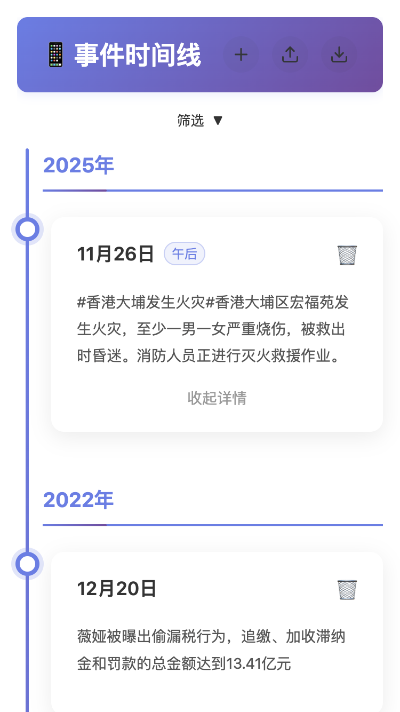
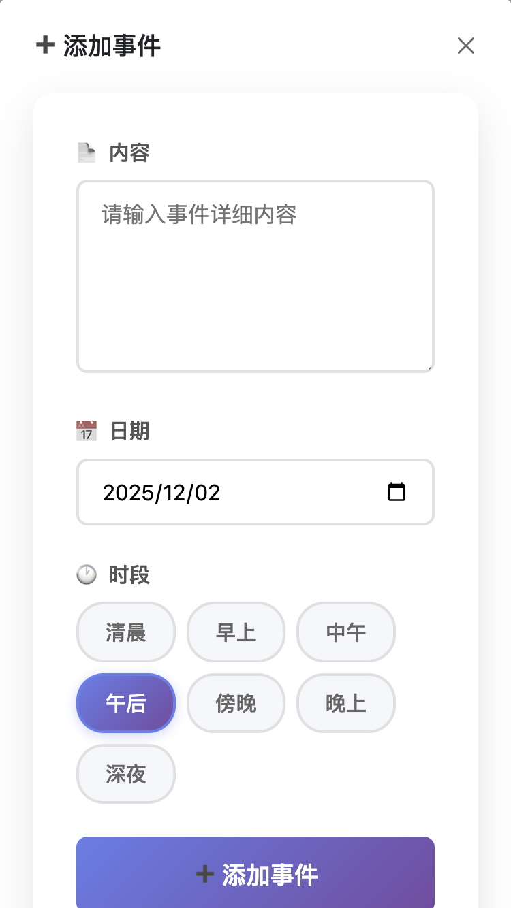

# 微博大事件时间线工具

这是一个基于 Vue 3 和 Vite 构建的微博大事件时间线工具，用于记录和展示重要的社交媒体事件。

## 功能特性

- 📅 **事件记录**：添加重要事件，包含内容、日期和时段
- 🗓️ **时间线展示**：按年份分组展示事件，支持时间段筛选
- 🔍 **筛选功能**：支持按年份、月份、日期和关键字筛选事件
- 💾 **数据持久化**：使用 localStorage 存储数据
- 📥 **数据导入**：支持从文本文件导入事件数据
- 📤 **数据导出**：可将事件数据导出为 TXT 文件
- ☁️ **自动化部署**：支持通过 GitHub Actions 自动部署到腾讯云 CVM
- 📱 **响应式设计**：适配移动端和桌面端

## 快速开始

### 安装依赖

```bash
npm install
```

### 启动开发服务器

```bash
npm run dev
```

### 构建生产版本

```bash
npm run build
```

## 使用说明

### 添加事件

1. 点击右上角的 ➕ 按钮
2. 输入事件内容（标题会自动从内容第一行提取）
3. 选择日期和时段
4. 点击提交

### 导入数据

1. 点击右上角的 📥 按钮
2. 粘贴符合格式的数据或使用示例数据
3. 点击"开始导入"

数据格式示例：
```
2022年

12月17日深夜
王力宏前妻李靓蕾微博发长文控诉...

12月19日
腾讯音乐娱乐集团...
```

### 筛选事件

1. 点击时间线下方的"筛选"按钮
2. 选择年份、月份、日期进行筛选
3. 或输入关键字搜索相关内容

### 导出数据

1. 点击右上角的下载按钮
2. 数据将按年份分组导出为 TXT 文件

## 时段分类

- 🌅 清晨 (0:00 - 8:59)
- 🌞 早上 (9:00 - 11:30)
- 🌞 中午 (11:31 - 12:59)
- 🌤 午后 (13:00 - 16:59)
- 🌇 傍晚 (17:00 - 18:59)
- 🌃 晚上 (19:00 - 21:59)
- 🌙 深夜 (22:00 - 23:59)

## 技术栈

- Vue 3 (Composition API)
- Vite
- Naive UI (部分组件)

## 示例数据

项目包含示例数据文件 `public/example.txt`，可直接导入使用。

## 开发

```bash
# 安装依赖
npm install

# 启动开发服务器
npm run dev

# 构建生产版本
npm run build

# 运行测试
npm test
```

## 界面截图

### 主时间线界面


### 导入数据界面


### 添加事件界面


## 部署到腾讯云 CVM (Docker 环境)

本项目支持通过 GitHub Actions 自动部署到腾讯云 CVM 的 Docker 环境。详细配置说明请参考 [DEPLOYMENT.md](DEPLOYMENT.md) 文件。

### 配置步骤

1. 在腾讯云创建 CVM 实例并安装 Docker
2. 配置 GitHub Secrets
3. 推送代码到主分支即可自动部署